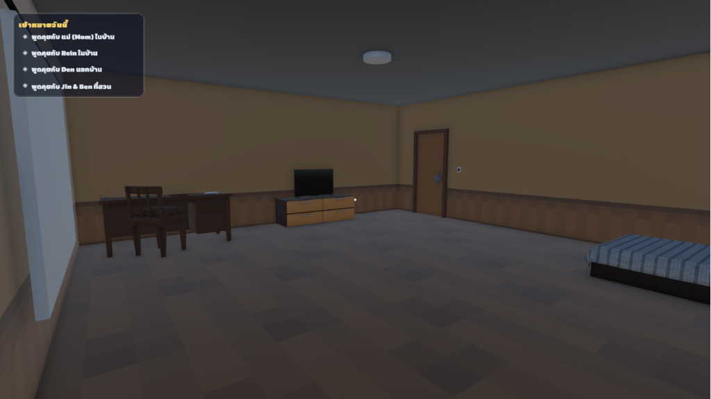
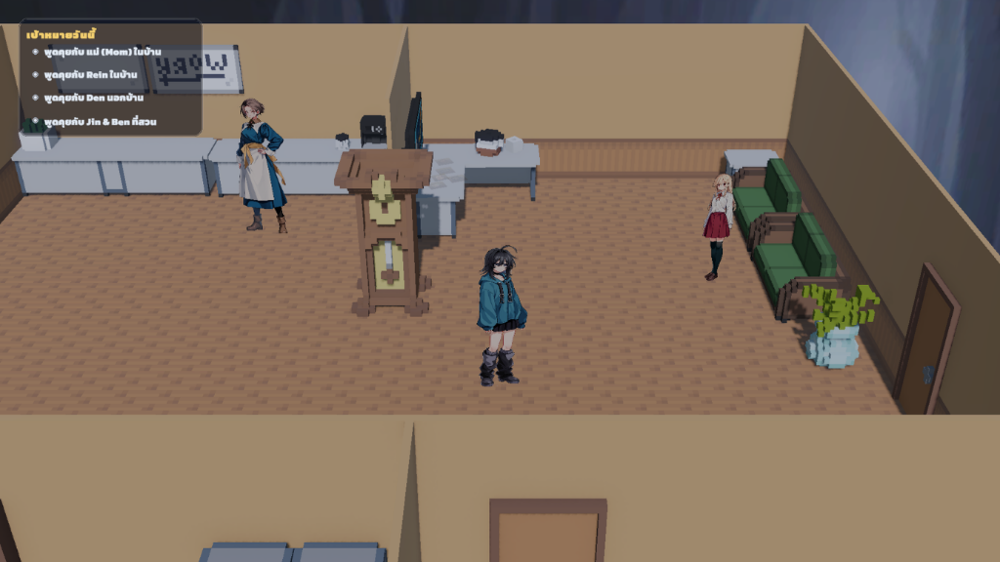
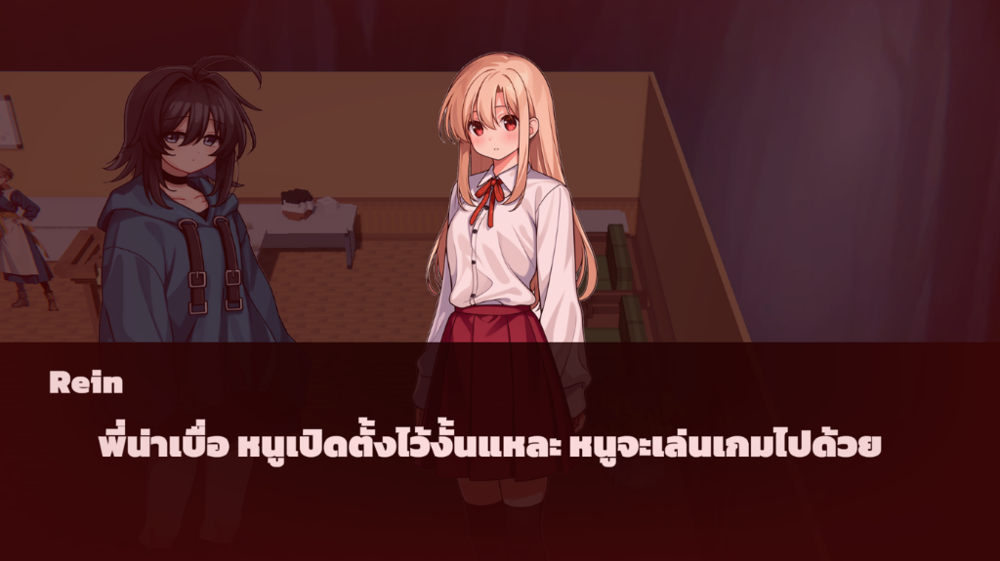
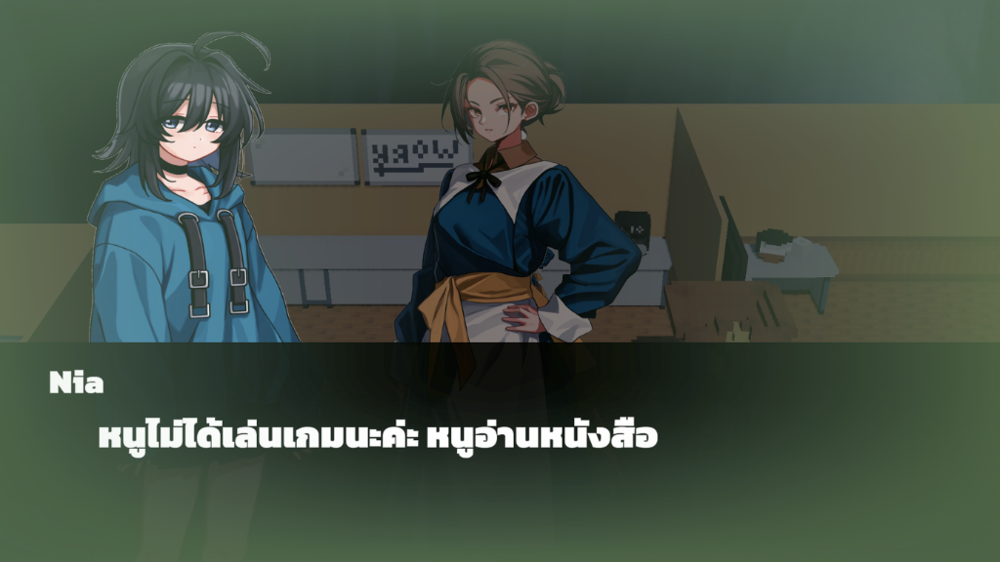
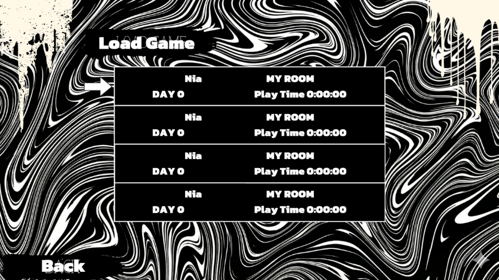

# Depressonant (Unity)

**Depressonant** เป็นเกมแนว Psychological Narrative Adventure พัฒนาด้วย Unity Engine (C#) ถ่ายทอดประสบการณ์การรับมือกับภาวะความเครียดและสภาวะจิตใจผ่านเรื่องราวชีวิตประจำวันของตัวละครเอก "เนีย (Nia)" ผู้เล่นจะต้องสำรวจสภาพแวดล้อม จัดการระดับความเครียด และตัดสินใจผ่านบทสนทนาและปฏิสัมพันธ์ในแต่ละวันตลอด 17 วัน เพื่อนำไปสู่ฉากจบที่หลากหลาย (Good / Normal / Bad Ending)

---

## ข้อมูลโปรเจกต์ (Project Overview)
- **Engine / Framework:** Unity 2022+ (Universal Render Pipeline - URP)
- **Programming Language:** C# (.NET)
- **Platform:** PC (Windows)
- **Genre:** Psychological / Narrative Adventure / Life Simulation
- **Role in Project:** Gameplay Programmer & Systems Developer (ผู้พัฒนาเกมเพลย์ โครงสร้างระบบ และ UI/UX)

---

## ภาพตัวอย่างเกมและระบบเด่น (Screenshots & Showcase)

<table>
  <tr>
    <td width="50%">
      
      
<b>สภาพแวดล้อมห้องนอน 3D และระบบเป้าหมายประจำวัน (Daily Quest HUD)</b>

    </td>
    <td width="50%">
      
      
<b>การจัดวางฉากบ้าน ปฏิสัมพันธ์กับตัวละคร และมุมกล้อง Orthographic</b>

    </td>
  </tr>
  <tr>
    <td width="50%">
      
      
<b>ระบบบทสนทนาภาษาไทย พร้อมการแสดงภาพตัวละครและปรับโทนบรรยากาศ (Rein)</b>

    </td>
    <td width="50%">
      
      
<b>ระบบบทสนทนาแบบไดนามิก รองรับการตรวจจับเงื่อนไขเวลาและเควส (Mom)</b>

    </td>
  </tr>
  <tr>
    <td colspan="2" align="center">
      
      
<b>ระบบบันทึกและโหลดเกมแบบหลายช่อง (Multi-Slot Save & Load System)</b>

    </td>
  </tr>
</table>

---

## หน้าที่และความรับผิดชอบหลัก (Key Responsibilities)

### 1. สถาปัตยกรรมระบบหลัก (Core Game Architecture)
- ออกแบบและพัฒนาระบบวงจรเวลาประจำวัน (17-Day Cycle Loop) ควบคุมการเปลี่ยนวัน การนอนหลับ และการเปลี่ยนผ่านของเหตุการณ์
- วางโครงสร้าง Singleton Managers (`GameManagerSetup`, `DayManager`, `InventoryManager`, `DialogueManager`) เพื่อจัดการ State ของเกมและข้อมูลกลางข้ามฉากอย่างเป็นระบบ

### 2. ระบบการเล่นและกลไกความเครียด (Stress & Mental Health Mechanics)
- พัฒนาระบบคำนวณและปรับเปลี่ยนระดับความเครียด (Stress System) ตามพฤติกรรมและการเลือกของผู้เล่น
- เชื่อมโยงระดับความเครียดสะสมกับการแสดงผลของ UI บันทึกไดอารี่ และการคำนวณฉากจบ (Good / Normal / Bad Ending)

### 3. ระบบกระเป๋าเก็บของและไอเทมแบบตอบสนอง (Inventory & Interactive Item System)
- พัฒนาระบบ Inventory รองรับการเก็บ, ซ้อนชิ้น (Stacking), การตรวจสอบคำอธิบาย (Examine Box) และการใช้ไอเทม
- ระบบไดอารี่แบบไดนามิก (Dynamic Diary) ปรับเปลี่ยนข้อความและสภาวะจิตใจตามระดับความเครียดสะสมในแต่ละวัน
- พัฒนาระบบไอเทม 3D ในฉาก (`PickupItem` & `ItemGlowEffect`) พร้อมระบบจดจำสถานะการเก็บ (`uniqueItemID`) ไม่ให้เกิดซ้ำ

### 4. ระบบบทสนทนาและเควสประจำวัน (Dialogue & Daily Quest System)
- พัฒนาระบบกล่องข้อความบทสนทนารองรับภาษาไทย (Thai Text Formatting & Glyph Adjuster)
- พัฒนาระบบเควสประจำวัน (Daily Quest HUD) ที่ทำงานประสานกับการเปิด-ปิด UI อื่นๆ อย่างราบรื่น

### 5. ระบบจัดการเสียงและมิกเซอร์ (Audio Architecture)
- ออกแบบระบบจัดการเสียงด้วย Unity AudioMixer แยกกลุ่ม Master, BGM และ SFX
- เชื่อมต่อการปรับระดับเสียงผ่าน Expose Parameters และ Settings UI

### 6. ระบบบันทึกและโหลดข้อมูลเกม (Save & Load System)
- พัฒนาระบบเซฟเกมแบบหลายช่อง (Multi-slot Save System) จัดเก็บตำแหน่งตัวละคร, วันที่, ค่าความเครียด, รายการไอเทม และสถานะของฉาก
- จัดการปัญหาการโหลดข้ามฉาก (Scene Transition & Spawn Point Resolver)

### 7. เครื่องมือช่วยพัฒนาสำหรับ Unity Editor (Custom Editor Tools)
- พัฒนา Editor Script สำหรับการกระจายไอเทมลับประจำวันลงในฉาก (Daily Item Bake Tool)
- พัฒนาคำสั่งตรวจสอบความถูกต้องของ AudioMixer และเครื่องมือติดตั้งไอเทมอัตโนมัติ (Verification & Setup Tools)

---

## ระบบเด่นเชิงเทคนิค (Technical Highlights)

- **Decoupled Architecture:** ใช้ Event-driven และ State Pattern ในการสื่อสารระหว่างระบบ Dialogue, Inventory และ DayManager เพื่อลด Coupling
- **Robust State Persistence:** การตรวจสอบ ID ของไอเทม (`uniqueItemID`) ผ่านฐานข้อมูลส่วนกลาง ป้องกันปัญหาไอเทมเกิดซ้ำเมื่อเปลี่ยนฉากหรือโหลดเซฟ
- **Responsive UI & Scene Handling:** การจัดการ Lifecycle ของ UI Canvas ให้รองรับทั้งโหมด Playtest, Debug Console และการเปลี่ยนฉากโดยไม่มีปัญหา Missing References หรือ Memory Leak
- **Modular SFX Pipeline:** ระบบเล่นเสียงประกอบที่มี Fallback อัตโนมัติในกรณีที่ยังไม่ได้ผูก Asset ใน Inspector

---

## สิ่งที่ได้เรียนรู้และพัฒนาขึ้น (Key Learnings)

- การออกแบบโครงสร้างโค้ดเกมขนาดกลางให้รองรับการขยายตัว (Scalability) และทำงานร่วมกับทีมผ่าน Git
- การจัดการ Lifecycle ของ GameObject และ Scene Management ใน Unity อย่างถูกต้อง
- การสร้าง Custom Tools ใน Unity Editor เพื่อเพิ่มประสิทธิภาพและลดเวลาในการทำงาน (Workflow Optimization)
- ทักษะการ Debug และแก้ไขปัญหาเชิงลึก เช่น Memory Cleanup, Hierarchy Optimization และ UI Component Exceptions
